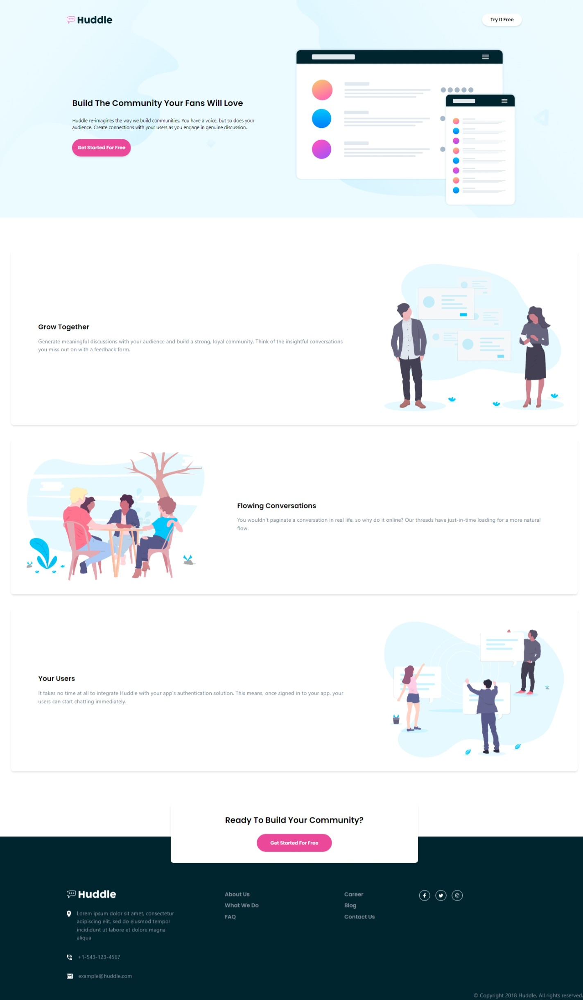
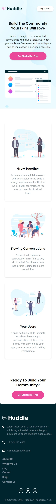

# Frontend Mentor - NFT preview card component solution

This is a solution to the [Huddle landing page with alternating feature blocks challenge on Frontend Mentor](https://www.frontendmentor.io/challenges/huddle-landing-page-with-alternating-feature-blocks-5ca5f5981e82137ec91a5100). 

## Table of contents

- [Overview](#overview)
  - [Screenshot](#screenshot)
- [My process](#my-process)
  - [Built with](#built-with)
  - [What I learned](#what-i-learned)

## Overview

This as the NFT preview card design challenge from [Frontend Mentor](https://www.frontendmentor.io).

### Screenshot

|  |  |
|:-----------------------:|:-----------------------:|
|     Desktop Design  |    Mobile Design  |


## My process

### Built with

- **Tailwind CSS** was had the major work with styling.
- **Flexbox** concepts are still leading the desing.


### What I learned

Using **Tailwind CSS Classes** & **Flexbox** to achieve the easiet design ever.
```html
<a href="" class="bg-pink-500 inline-block p-4 px-10 rounded-full shadow-mg text-white text-md text-sm hover:bg-pink-300 hover:shadow-lg">Get Started For Free</a>

```
